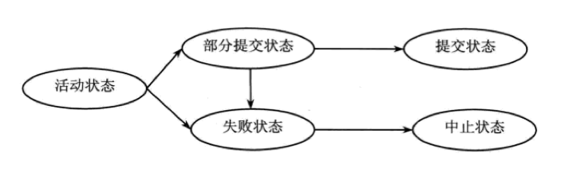

---

---

# 一、SQL基础相关

## SQL

### SQL分类

#### DML 数据操作语言

- INSERT

- DELETE

- UPDATE

- TRUNCATE

  ```sql
  -- 删除记录后立即回收记录占用空间（默认）
  truncate table user drop storage;
  -- 删除记录后仍保存记录占用空间
  truncate table user reuse rop storage;
  ```

- CALL

- EXPLAIN PLAN

- LOCK TABLE

- MERGE

#### DCL数据控制语言

- GRANT

  对属性列和视图的权限：SELECT、INSERT、UPDATE、DELETE、ALL PRIVILEGES

  对表的权限：SELECT、INSERT、UPDATE、DELETE、ALTER、INDEX、ALL PRIVILEGES

  对数据库权限：CREATETAB

- REVOKE

### JOIN连接

- INNER JOIN
- NATURAL JOIN
- OUTER JOIN

### 集合操作

- UNION

  求两个结果集的并集，并去重。

- UNION ALL

  求两个结果集的并集，不去重。

- INTERSECT

  求两个结果集的交集。

- MINUS

  求两个结果集的差集。

  

### 常用子句

- ORDER BY

  ASC 升序；DESC 降序。 默认ASC。

- GROUP BY

  - rollup ：进行行汇总
  - having：对分组后的数据进行过滤。也可以单独使用，相当于where。

- EXISTS

### 常用函数

#### 字符类函数

```sql
-- concat(a,b) : 将b字符串拼接在a之后

-- initcap(a) : 返回a字符串的首字母大写，其他非首字母小写的格式

-- instr(a,b,i,j)：从a的第i个字符开始搜索，返回b在a字符串中第j次出现的位置。若为负数，则从字符串的右侧对应的第i个字符串开始搜索，但返回的字符串位置还是从左向右数的位置。找不到则返回0。

-- instrb(a,b,i,j)：同instr(a,b,i,j)函数，只是i,j代表的是字节。

-- length(a)：返回a字符串的长度，若a为null，则返回null。

-- lower(a)：返回a字符串的小写。
-- upper(a)：返回a字符串的大写。

-- trim(a)：将a字符串的前后空格删除

-- ltrim(a,b)：将a字符串中最左边的b字符串去掉
select ltrim("abcde", "abc") from dual; -- 返回：de

-- replace(a,b,c)：用c字符串替换a字符串中的b字符串
select replace("我是猪", "我", "你") from dual; -- 返回：你是猪

-- substr(a, i, j)：从a字符串的第i个位置截取，返回长度为j的字符串
-- substr(a, i)：   从a字符串的第i个位置截取，返回从i到字符串末尾的字符串
```

#### 数字类函数

```sql
-- ABS(n)：返回n的绝对值

-- FLOOR(n)：返回小于等于n的最大整数（向下取整）

-- ROUND(n)：返回n四舍五入后的整数
-- ROUND(n,m)：返回n保留m为小数时四舍五入后的结果

-- SIGN(n)：若n<0，返回-1；若n>0,返回1；若n=0,返回0

-- MOD(n, m)：返回n除以m的余数
```

#### 日期类函数

```sql
-- SYSDAT ： 返回系统当前时间
-- ADD_MONTHS(d, i)：返回日期d加上i个月后的日期
-- LAST_DAY(d)：返回当前日期所属月份的最后一天
select last_day(to_date('2020-02-21','yyyy-mm-dd')) from dual; -- 返回:2020/2/29
```

#### 转换类函数

```sql
-- TO_DATE(s, format)：将字符串s按照format的形式格式化为时间类型
select to_date('2020-02-21','yyyy-mm-dd') from dual; -- 返回:2020/2/21

-- TO_NUMBER(n, format)：将字符串n按照format的形式格式化为数字类型
```

#### 聚合类函数

```sql
-- AVG(x)：默认对所有x的数据求平均，相当于：AVG(all x)
-- AVG(distinct x) ：对去重后的x求平均

-- 以下聚合函数也有类似于AVG(distinct x)、AVG(all x)的用法
-- COUNT(x)
-- MAX(x)
-- MIN(x)
-- SUM(x)
-- STDDEV(x)：统计标准差（方差平方根）
-- VARIANCE(x) :统计方差
```


#### 其他类函数

#### 

## 视图

### with check option 用法

## 索引

### 索引作用

索引是数据库对象之一，用于加快数据的检索。

### 索引分类


# 二、PL/SQL基础

## 语句控制结构

- if...then
- if...then...else
- if...then...elsif
- case
- loop...exit...end
- loop...exit when...end
- where...loop...end
- for...in...loop...end
- goto

## 游标


## 存储过程


## 触发器


# 三、Oracle基础

## 启动oracle

### 启动时的主要过程

- 启动oracle实例：`STARTUP NOMOUNT`

  读取**SPFILE**或**PFILE**，初始化**SGA**和**PGA**内存空间，设置后台进程的其他参数，启动实例进程；

  打开跟踪文件和预警文件。

- 装载数据库：`STARTUP MOUNT`

  由control_files参数找到控制文件，在控制文件中获取数据文件、重做日志文件等重要参数；

  此时数据库仍未启动，处于状态状态，可进行如下操作：

  - 重命名、新增、删除获取数据文件、重做日志文件
  - 执行数据库完全恢复
  - 改变数据库归档模式

- 打开数据库：`STARTUP OPEN` 或 `STARTUP`

  数据库处于正常运行状态。

**总结：**

1. `STARTUP NOMOUNT`、`STARTUP MOUNT`、`STARTUP OPEN` 后面的每个命令都包含了前面命令的执行过程；
2. 数据库启动过程中文件使用顺序：参数文件 -> 控制文件 -> 数据文件、日志文件。

### SQL*Plus启动命令

1. 正常启动

```sql
-- 启动数据库实例
startup nomount
-- 启动数据库实例 + 装载数据库
startup mount
-- 启动数据库实例 + 装载数据库 + 打开数据库，作用等同于：startup
startup open
```

2. 异常启动

```sql
-- 强制关闭数据库 + 启动数据库，相当于： shutdown abort + startup
-- 一般用于数据库出现异常时，强制启动使用，一般慎用。
startup force
-- 启动数据库，但只允许特权用户访问，如DBA
-- 一般用户访问将报错：ORA-01035: ORACLE 只允许具有 RESTRICTED SESSION 权限的用户使用。
-- 可使用语句关闭特权用户访问限制：alter system disable restricted session;
startup restrict
```


## 关闭Oracle

### 关闭时的主要过程

- 关闭数据库

  Oracle将重做日志高速缓存中的数据存入重做日志文件；

  Oracle将数据库高速缓存中被更改过的数据存入数据文件；

  在数据文件中执行一个检查点，记录关闭数据库时间；

  关闭所有数据文件和重做日志文件。

- 卸载数据库

  更新控制文件中相关数据；

  关闭控制文件。

- 终止实例

  关闭实例进程拥有的所有进程和服务；

  回收SGA和PGA占用的内存。

### SQL*Plus启动命令

```sql
-- 正常关闭数据库
shutdown
shutdown normal
-- 尽可能快的关闭数据库，将等待所有未提交的事物提交后关闭
shutdown transactional
-- 立即关闭数据
shutdown immediate
-- 在数据库异常，以上三种方式无法关闭时使用
shutdown abort
```

## 数据库表相关

### 索引

- 是什么？

  是一种建立在表上的数据对象。通过在表中的一列或多列上建立索引，从而加快数据检索。

- 如何用？

  

- 注意点

  创建主键时，Oracle会自动创建主键索；

### 视图

- 是什么？

  视图是由select子查询定义的一个逻辑表，只有定义，无数据，又称为“虚表”。

- 能干什么？

  增加数据安全性，隐藏数据复杂性，简化查询语句，执行特殊查询，保存复杂查询。

### 序列

### 触发器

# 四、数据库备份与恢复


# 五、重做日志


# 六、数据库事务

## 事务的特性 

原子性、一致性、隔离性、持久性 

## 事务的状态

- 活动状态

  事务在执行时的状态。

- 部分提交状态

  事务中最后一条语句被执行后的状态。此时事务已经完成，但此时事务的结果可能还在内存中，若发生硬件故障，则事务将变为中止状态。

- 提交状态

  部分提交状态后，事务数据将由内存写入硬盘。当此事务相关数据均被写入硬盘后，将变为提交状态。

- 失败状态

  事务执行失败时的状态。后续将进入中止状态。

- 中止状态

  事务执行回滚，且数据被恢复到该事务执行签的状态，称为中止状态。

各状态的转换：




## 事务提交方式

1. 显示提交

   通过commit命令提交事务。

2. 自动提交

   通过设置开启自动提交：`set autocommit on;` 。

3. 隐式提交

   非显示提交的事务，也被称为隐式提交。

## 事务提交原理

**数据一致性前提：**

为保证数据一致性，Oracle为每个登录的用户在SGA内存中分配了工作区。用户的事务处理操作都在该工作区内完成，当事务提交后，才将工作区修改的内容写入数据库中（物理写入）。通过此方式保证此事务未提交前，其他客户端查看的数据是一致的。

1. 事务提交前SGA状态
   - 回滚缓冲区生成回滚记录，回滚信息包括已经修改的旧值；
   - 日志缓冲区生成该事务的日志，该日志在提交前已经写入理磁盘；
   - 数据库缓冲区被修改，这些修改在事务提交后才被写入物理磁盘。
2. 事务提交时的工作
   - 为事务生成唯一的系统变更号SCN（system change number），并在相关事务表中记录事务提交信息；
   - 将数据缓冲区中的数据写入物理磁盘；
   - 日志写入进程(LGWR)将SGA日志缓冲区的日志写入联机日志文件；
   - 解除对记录和表的锁
   - 标记该事务已完成
3. 


